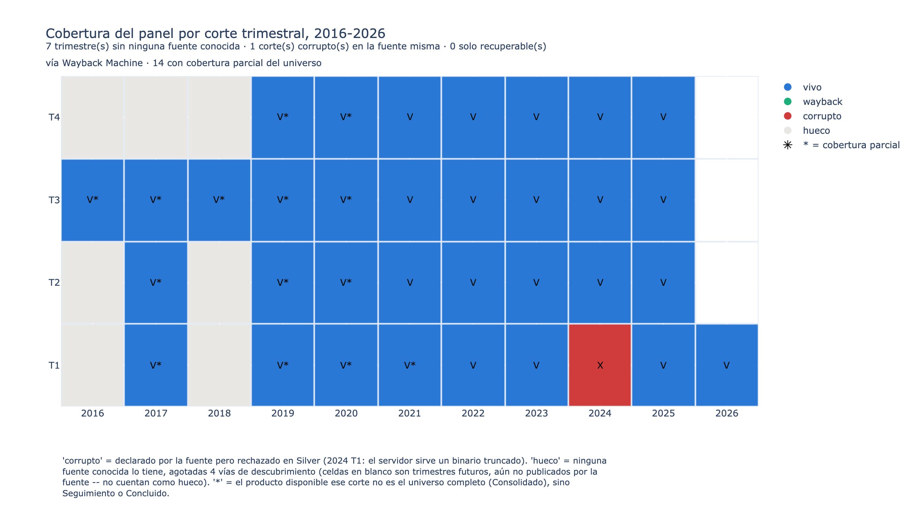
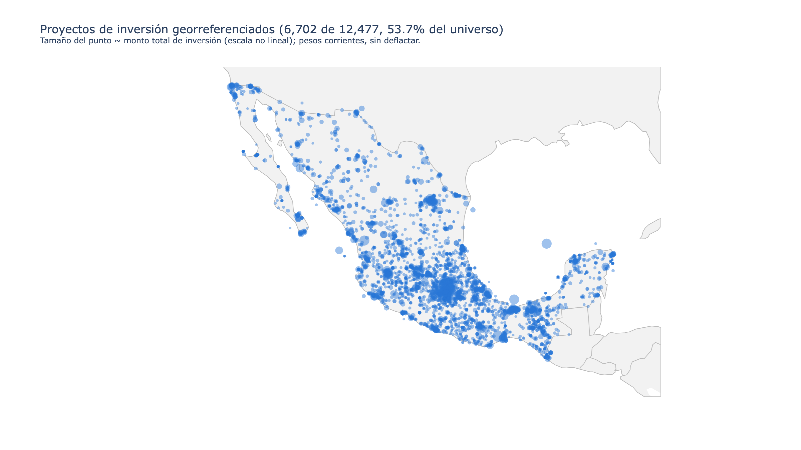
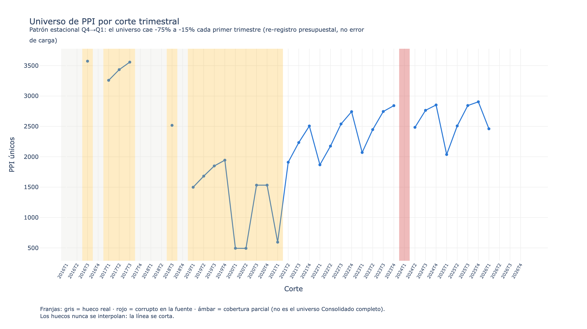
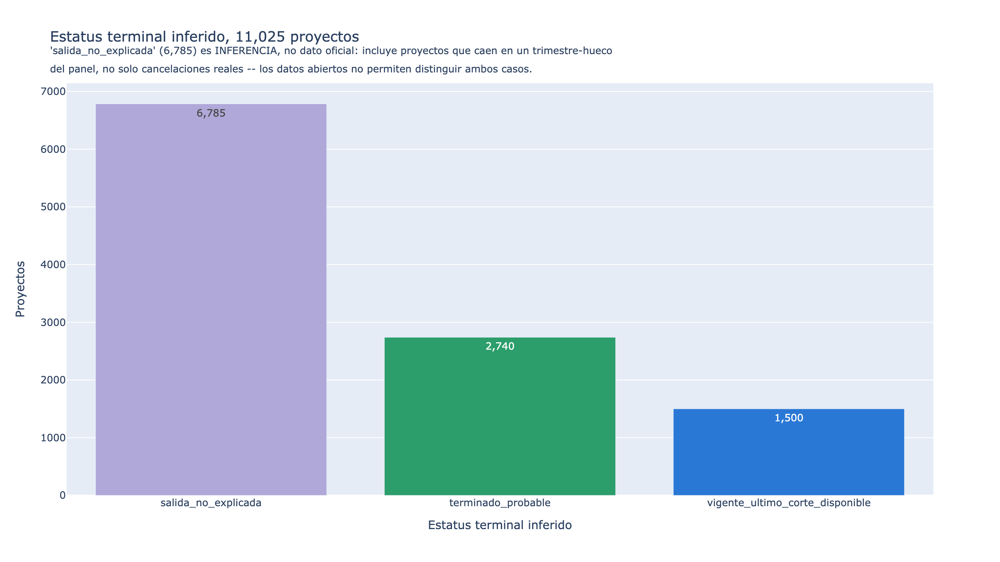

# Panel Histórico de Obra Pública Federal (México)

Serie histórica trimestral 2015–2026 del padrón de **Programas y Proyectos de Inversión (PPI)**
del gobierno federal mexicano, reconstruida a partir de *Obra Pública Abierta* (OPA) de la SHCP.

**[⬇ Descargar los datos — release `datos-2026T1`](https://github.com/iChocko/panel-obra-publica-mx/releases/tag/datos-2026T1)**
· CSV + Parquet + GeoJSON · catálogo DCAT · nota técnica · checksums verificables

---

## El problema

La Secretaría de Hacienda publica cada trimestre una fotografía del universo de proyectos de
inversión federal en su portal de Obra Pública Abierta: qué se está construyendo, dónde, con
cuánto presupuesto, con qué avance físico.

El problema es cómo la publica. **Cada fotografía nueva sobreescribe a la anterior.** El visor
oficial muestra solo el corte más reciente, y los archivos de descarga con nombre genérico
(`proyectos_opa.csv`) apuntan siempre al último trimestre. No hay archivo histórico, no hay
versionado, no hay forma oficial de preguntar "¿cómo se veía este proyecto hace tres años?".

Eso tiene una consecuencia concreta para cualquiera que quiera analizar inversión pública: **se
puede ver el estado actual de un proyecto, pero no su trayectoria.** No se puede medir cuánto se
encareció una obra respecto a su presupuesto original, cuánto tardó de más, cuántos proyectos se
cancelaron a media ejecución, ni qué dependencias tienen sobrecostos sistemáticos. La información
existió públicamente en algún momento —trimestre por trimestre— pero la fuente destruye su propia
historia conforme avanza.

Este repositorio reconstruye esa historia y la publica como un panel longitudinal por clave de
cartera, que hoy no existe en ningún otro lugar público.

## Cómo se resolvió

La reconstrucción se apoya en tres fuentes en cascada, porque ninguna sola alcanza:

| Fuente | Qué aporta |
|---|---|
| **Servidor vivo de la SHCP** | Los archivos con trimestre explícito en el nombre siguen ahí, aunque el portal no los enlace. Hay que adivinar la URL. |
| **Wayback Machine** (CDX API) | Capturas de archivos de datos —CSV y XLSX reales, no solo HTML— de cortes que ya no están vivos. |
| **Manifiesto JSON del portal** | El propio portal expone un índice interno de descargas que etiqueta URLs con su trimestre en texto plano. Útil como pista, no como verdad (ver *Hallazgos*). |

El resultado: **29 de 36 trimestres del periodo 2016–2024 son recuperables (80.6%)**, además de
2015 y de todo 2025–2026. Los 7 trimestres restantes se agotaron por cuatro vías independientes y
quedan documentados como huecos reales, no interpolados.



Azul es dato real; rojo es un corte que la fuente declara pero llega corrupto; gris es un hueco
real sin ninguna fuente conocida. El asterisco marca cobertura parcial (no es el universo
Consolidado completo). Galería completa con interpretación de cada figura:
[`reports/figuras/GALERIA.md`](reports/figuras/GALERIA.md).

## Qué hay en el panel

Números reales del build actual (`data/gold/panel_opa.duckdb`):

| | |
|---|---|
| **11,025** | proyectos de inversión únicos (`cve_cartera`) |
| **173,316** | observaciones proyecto × corte trimestral |
| **34** | cortes trimestrales canónicos, 2015–2026 |
| **6,702** | proyectos con coordenadas geográficas válidas |
| **16,560** | versiones históricas de atributos (SCD2: cambios de nombre, ramo, ubicación) |

Con eso se puede responder, por primera vez de forma directa: sobrecosto por proyecto (monto
inicial vs. final), duración observada vs. planeada, trayectoria de avance físico, cambios de
estatus, proyectos que desaparecen del padrón sin explicación, y la distribución geográfica de la
inversión federal a lo largo de once años.



## Arquitectura: cuatro capas

El pipeline sigue el patrón **medallón** (Bronze → Silver → Gold), más una capa de publicación.
La idea central es que cada capa tiene una responsabilidad y **ninguna puede corregir en silencio
lo que hizo la anterior**: si algo no cuadra, el proceso se detiene y lo reporta.

### Bronze — archivar sin tocar

Descarga los archivos tal como los sirve la fuente y **nunca los reescribe**. Cada archivo se
guarda con los primeros 8 caracteres de su SHA-256 en el nombre
(`opa_{año}_{trimestre}_{sha8}.csv`), lo que lo hace *direccionable por contenido*: volver a
correr la ingesta es idempotente por diseño, no por una bandera de "saltar existentes".

Estado actual: **142 renglones de manifiesto** (89 desde el servidor vivo, 53 solo vía Wayback)
→ **137 archivos en disco** → **128 contenidos únicos por hash** (el mismo archivo aparece a veces
bajo dos URLs distintas). 236 MB en total.

`data/manifest.jsonl` guarda la procedencia completa de cada uno —URL, origen, SHA-256, fecha de
descarga, corte declarado— y **sí está versionado en git**: es la prueba de reproducibilidad y
satisface el requisito de cita de los Términos de Libre Uso MX. Los archivos crudos no están en
git por peso, pero cualquiera puede regenerarlos byte por byte con `opa bronze`.

### Silver — normalizar sin adivinar

Aquí vive el trabajo sucio. Inspeccionar los 128 archivos reales (no una muestra) reveló **11
esquemas distintos**, no los 2 que se esperaban:

- **2019–2026 es un esquema único y estable** (79 de 128 archivos, sin cambios en siete años).
- **2015–2018 tiene 9 variantes reales**: la nomenclatura de columnas cambia varias veces dentro
  del mismo año, hay columnas que aparecen y desaparecen entre cortes (`MODIFICADO` y
  `AVANCE_FISICO` simplemente no existían en un snapshot de 2016 — no son nulos, la columna no
  estaba), y hay **dos bugs de la fuente misma**: el anual de 2018 trae una columna llamada
  `CVE_PPI` dos veces (la segunda debería decir `NOMBRE`), y un snapshot de 2016 repite `RAMO`
  donde debería decir `DESC_RAMO`.

`conf/schema_map.yml` documenta cada variante con su hash de encabezado y el mapeo columna por
columna a nombres canónicos. Los mapeos que son un juicio semántico razonado —y no una
confirmación oficial— se marcan explícitamente como `[inferido]`.

Sobre eso corre un **contrato de datos** (Pandera) que valida cada fila antes de escribirla.
Resultado real: de 179,179 filas procesadas, **98.9% pasan el contrato**. El resto queda en
cuarentena con el motivo exacto documentado por archivo, no descartado en silencio.

Salida: un Parquet por snapshot en `data/silver/` (78 MB).

### Gold — el modelo dimensional

`dbt` transforma los Parquet en el panel consultable, materializado en **DuckDB**:

| Modelo | Qué es |
|---|---|
| `fct_ppi_observacion` | Tabla central. Un renglón por proyecto por corte. Todo lo demás se deriva de aquí. |
| `dim_ppi` | SCD2 sobre atributos que cambian rara vez (nombre, ramo, unidad responsable, ubicación). Un renglón por periodo de vigencia. |
| `fct_ppi_delta` | Cambio contra el corte anterior: Δmonto, Δavance, cambio de estatus, bandera de renombramiento. |
| `fct_ppi_ciclo_vida` | Un renglón por proyecto: sobrecosto %, duración, estatus terminal inferido. |
| `dim_snapshot` | Metadatos y procedencia de cada corte, incluidos los que se excluyeron y por qué. |
| `dim_ramo`, `dim_entidad`, `dim_tipo_ppi` | Catálogos, ampliados con códigos históricos que ya no están en el catálogo oficial vigente. |

**40 de 40 tests pasan**, incluidos tres tests personalizados que codifican reglas de negocio
reales (unicidad del grano, avance físico decreciente con bandera, estabilidad de conteo por
ramo).

### Publicación — el paquete distribuible

`opa publish` empaqueta el panel en formatos abiertos, de forma **determinista**: el mismo DuckDB
produce siempre los mismos bytes, verificado corriendo dos veces y comparando.

- **CSV** (RFC 4180) — el formato base que exigen los Lineamientos de datos abiertos.
- **Parquet** — mismo contenido con tipos preservados, para análisis sin re-parseo.
- **GeoJSON** (RFC 7946) — un `FeatureCollection` por año, listo para QGIS/Leaflet sin ETL previo.
- **`catalog.json`** — catálogo DCAT (JSON-LD) con metadatos, procedencia y calidad reales.
- **`NOTA-TECNICA.md`** — limitaciones conocidas, viajando *con* los datos, no solo en el repo.
- **`checksums.sha256`** — integridad de todo lo anterior, incluidos el catálogo y la nota.

## El stack, y por qué

| Herramienta | Para qué | Por qué esa |
|---|---|---|
| **Python 3.12 + `uv`** | Ingesta, normalización, CLI | `uv` resuelve el entorno de forma reproducible y rápida, sin `requirements.txt` a mano |
| **httpx** (+ fallback a `curl`) | Descarga | Ver la nota de TLS más abajo — el fallback resuelve un problema real del servidor de la SHCP |
| **pandas + pyarrow** | Transformación y Parquet | Estándar para este volumen; no hace falta Spark para 180 mil filas |
| **Pandera** | Contrato de datos en Silver | Valida por esquema declarativo y separa filas válidas de cuarentena sin perder el motivo |
| **dbt + DuckDB** | Capa Gold | SQL versionado, con linaje y tests como parte del build. DuckDB da un panel analítico en un solo archivo, sin servidor |
| **Typer + Rich** | CLI | Un comando por etapa, salida legible |
| **pytest + ruff** | Pruebas y linting | 138 tests, CI en GitHub Actions |

Decisión de diseño transversal: **fallar ruidoso**. Si aparece un esquema no mapeado, una columna
sin documentar o un insumo faltante, el proceso sale con código 1 en vez de continuar con datos
parciales. Vale más un build roto que un dataset silenciosamente incompleto.

## Hallazgos reales

Lo que se aprendió reconstruyendo esto — y que no estaba en ninguna documentación:

**El hueco 2022–2026 no era una descontinuación, era un cambio de nombre.** El portal migró a una
aplicación Next.js y renombró los archivos trimestrales dentro de la *misma* carpeta que ya se
recorría: de `reporteOPA{n}Trimestre.xlsx` a una familia nueva de `Consolidado…`, `Seguimiento…` y
`Concluido(s)…`. La pluralización de este último alterna por año sin regla clara: hay que probar
ambas formas.

**Un mismo trimestre puede tener tres archivos que no son duplicados.** Consolidado es el universo
completo, Seguimiento solo los vigentes, Concluido solo lo que terminó ese trimestre. Confundirlos
produce comparaciones sin sentido. 2020 T1 y T2 *solo* tienen Concluido disponible, así que su
universo no es comparable con el resto — queda marcado en el modelo para no confundir un hueco de
cobertura con un hallazgo real.

**Las etiquetas del portal no son confiables sin verificar el contenido.** El manifiesto oficial
etiquetaba `opa_trimestral.csv` como "Primer trimestre 2019", y el archivo vive en la carpeta
`/2019/` — pero al abrirlo, el 100% de sus filas trae `CICLO=2018`. Es un archivo de otro ciclo
fiscal mal ubicado por el propio portal. El T1 2019 real se encontró por analogía de patrón, no
por el manifiesto.

**Hay datos corruptos en la fuente misma.** Los tres archivos de 2024 T1 se sirven como binario
OLE2 (Excel antiguo) con extensión `.csv` y `Content-Type: text/csv`, truncados. El
`Content-Length` del servidor coincide con lo descargado —no es un problema de la descarga— y no
hay captura alterna en Wayback. Bronze los conserva como evidencia; Silver los rechaza
explícitamente.

**El `0` en las coordenadas no era basura, era un centinela.** El primer intento de normalización
daba 78% de filas válidas; casi todo el rechazo eran coordenadas fuera del bbox de México en los
esquemas de 2015–2018. Resultó que `0` significa "sin coordenadas" en el esquema viejo —48.6% de
las latitudes de 2015 son literalmente cero— y (0°N, 0°E) es imposible en México de cualquier
forma. Tratarlo como nulo antes de validar subió el resultado a **98.9%**. La diferencia fue un
hallazgo sobre los datos, no un ajuste cosmético del contrato.

**El grano que la arquitectura asumía no era único.** `(cve_cartera, snapshot_id)` tiene una sola
fila en el 99.35% de los casos, pero ~1,124 pares traen entre 2 y 33 filas. Investigando dos casos
reales: son programas de cobertura multi-entidad exportados como una fila por sub-asignación, con
un solo proyecto padre. La deduplicación suma los montos, toma el **máximo** del avance físico
(sumar un porcentaje estaría mal), y declara el colapso con `n_registros_agregados > 1` en vez de
esconderlo.

**La caída de proyectos cada enero no era un error de carga.** Un test de estabilidad marcó cinco
caídas de ≥70% en el conteo de proyectos por ramo. Se investigaron las cinco contra los datos, con
verificación adversarial independiente. Resultado: el padrón *completo* cae entre 15% y 29% cada
primer trimestre, todos los años (verificado en 2022, 2023, 2025 y 2026) — es el ciclo de
re-registro presupuestal de proyectos plurianuales al abrir el ejercicio fiscal. De los cinco
casos, ninguno era un archivo truncado: dos eran ese patrón estacional, uno era una
reorganización administrativa real (IMSS-BIENESTAR obtuvo ramo presupuestal propio en 2026 T1) y
uno era probable depuración de estudios de preinversión estancados. El test se ajustó para
excluir la transición Q4→Q1 y sigue activo para el resto.



**No todo proyecto que desaparece del padrón terminó.** De los 11,025 proyectos del panel, 6,785
quedan clasificados como "salida no explicada": nunca llegaron a 95% de avance y dejaron de
aparecer antes del corte más reciente. Eso puede ser una cancelación real, o un proyecto que cayó
justo en uno de los 7 trimestres-hueco del panel — los datos abiertos, tal como los publica la
SHCP, no permiten distinguir ambos casos. Es una limitación declarada, no una cifra que se
presente como certeza.



**Nota de entorno:** tanto `transparenciapresupuestaria.gob.mx` como `datos.gob.mx` sirven una
cadena de certificados TLS incompleta (rotaron su intermedio de Let's Encrypt pero el servidor no
lo envía). `httpx`/OpenSSL no hacen *AIA chasing* y fallan con `CERTIFICATE_VERIFY_FAILED`;
`curl` sí resuelve la cadena vía el almacén del sistema. `discovery.py` tiene un fallback a `curl`
para este caso exacto — **sin desactivar la verificación TLS**.

## Limitaciones conocidas

Declaradas a propósito, y empaquetadas junto con los datos en `NOTA-TECNICA.md`:

- **7 trimestres siguen sin recuperarse**: 2016 T1/T2/T4, 2017 T4, 2018 T1/T2/T4. Agotadas cuatro
  vías independientes de descubrimiento; el siguiente paso realista es una solicitud PNT/INAI a la
  SHCP, no más automatización.
- **`estatus_terminal_inferido` es una inferencia, no un dato oficial.** De los 11,025 proyectos,
  6,785 quedan como `salida_no_explicada`: desaparecieron del padrón sin llegar a 95% de avance.
  Eso puede significar cancelación real *o* que cayeron en uno de los trimestres que no se
  recuperaron — los datos abiertos no permiten distinguirlo.
- **La deflactación está pendiente.** Las columnas de montos reales existen pero salen `NULL`
  hasta que se cargue la serie de INPC de Banxico SIE (requiere un token de autoservicio). No se
  aproximó con un supuesto de inflación genérico.
- **`ejercido` y `modificado` no son directamente comparables.** El check de coherencia esperado
  falla en 18.5% de las filas reales, por márgenes de cientos de veces, no de redondeo — probable
  mezcla de un acumulado del proyecto contra un monto del ciclo vigente. Queda como pregunta
  abierta documentada, no como un check con tolerancia inflada para que pase.
- **Hay variantes de texto sin normalizar** en `estatus_operacion` y `descripcion_tipo_ppi` (11 y
  29 valores distintos, con diferencias de mayúsculas y espaciado de once años de captura). Los
  tests fijan el conjunto conocido hoy para detectar valores *nuevos*, no para certificar que
  estén limpios.

## Alineación a los Lineamientos de Datos Abiertos (ATDT)

El 11/09/2025 la Agencia de Transformación Digital y Telecomunicaciones publicó en el DOF los
[Lineamientos en materia de Datos Abiertos de la APF](docs/normativa/2025-09-11_ATDT_Lineamientos-Datos-Abiertos-APF.md)
(transcripción completa y PDF original en `docs/normativa/`), que sustituyeron la política que
antes coordinaba el INAI.

**Este repositorio no es una Institución Publicante** —los Lineamientos obligan a la
Administración Pública Federal, no a un proyecto ciudadano— pero adopta voluntariamente su parte
técnica, documentada en [`docs/PLAN-alineacion-gold-lineamientos-ATDT.md`](docs/PLAN-alineacion-gold-lineamientos-ATDT.md):
diccionario de datos, formatos tabulares abiertos, catálogo DCAT, metadatos de procedencia y
calidad, y nota técnica de contexto. Las obligaciones institucionales (Área Coordinadora, Plan
Institucional de Publicación) quedan explícitamente fuera de alcance: no se simula un
cumplimiento que no corresponde.

Dos notas relevantes, verificadas en vivo el 2026-08-08:

- **El panel no está duplicado en la Plataforma Nacional de Datos Abiertos.** Cero resultados para
  "Obra Pública Abierta" o "programas y proyectos de inversión" en el catálogo de `datos.gob.mx`,
  y no hay ninguna organización de Hacienda/SHCP entre las registradas.
- **El Manual Operativo de la ATDT —donde se definirán formatos y estructuras exactos— aún no se
  publica.** Por eso el catálogo usa vocabulario DCAT estándar del W3C y no un "perfil mexicano"
  inventado; los resúmenes propios de este repo viajan bajo claves con prefijo `x-` explícito,
  claramente separados del vocabulario oficial.

## Cómo correr el pipeline

Requiere [`uv`](https://docs.astral.sh/uv/) y Python 3.12 (que `uv` gestiona solo).

```bash
uv sync

# 1. Descubrimiento: prueba ~480 URLs candidatas contra la SHCP (1 req/2s, ≈45-50 min),
#    consulta la CDX API de Wayback. → reports/discovery.jsonl, reports/cobertura.md
uv run opa discover

# 2. Bronze: descarga completa de lo recuperable. → data/bronze/, data/manifest.jsonl
#    Idempotente: correrlo de nuevo solo baja lo que falte.
uv run opa bronze

# 3. Silver: normaliza a Parquet canónico con contrato de datos, sin red.
#    → data/silver/*.parquet, reports/calidad_silver.md
uv run opa normalize

# 4. Gold: seeds + modelos + tests de dbt. → data/gold/panel_opa.duckdb
dbt build --project-dir dbt --profiles-dir dbt

# 5. Diccionario de datos, derivado del schema.yml de dbt. → reports/diccionario/
uv run opa diccionario

# 6. Paquete publicable: CSV + Parquet + GeoJSON + DCAT + nota + checksums.
#    → data/publish/{version}/   (versión por defecto = corte más reciente del panel)
uv run opa publish

# 7. Figuras estáticas del panel (requiere Chrome para Kaleido -- si falta, correr una
#    vez `uv run plotly_get_chrome`). → reports/figuras/*.png + GALERIA.md
uv run opa figuras
```

Los pasos 1–3 son opcionales si solo se quiere el panel: el
[release publicado](https://github.com/iChocko/panel-obra-publica-mx/releases/tag/datos-2026T1)
ya trae el resultado final.

## Estructura del repositorio

```
conf/           Configuración declarativa: patrones de URL, mapeo de esquemas,
                metadatos DCAT, serie de deflactor
src/opa/        Paquete Python: discovery, bronze, normalize, diccionario,
                los cuatro módulos de publicación (tabular/geojson/dcat/nota)
                y figuras (visualizaciones estáticas)
dbt/            Capa Gold: staging → intermediate → marts, seeds y tests
tests/          155 tests (pytest)
reports/        Salidas versionadas: cobertura, esquemas, calidad, diccionario, figuras
docs/           Normativa ATDT (PDF + transcripción) y plan de alineación
data/           Bronze, Silver, Gold y paquetes publicados (fuera de git,
                salvo manifest.jsonl)
```

Documentos de diseño: [`viabilidad_tecnica`](viabilidad_tecnica) (dictamen inicial) y
[`ARQUITECTURA-panel-obra-publica-mx.md`](ARQUITECTURA-panel-obra-publica-mx.md) (arquitectura
completa). El README documenta lo que *se construyó*; esos documentos, lo que *se planeó* — las
diferencias entre ambos están anotadas arriba, en Hallazgos.

## Licencia

El **código** está bajo licencia [MIT](LICENSE).

Los **datos** son un conjunto separado, sujeto a los **Términos de Libre Uso MX**
(datos.gob.mx/libreusomx) bajo el "Decreto por el que se establece la regulación en materia de
Datos Abiertos" (DOF 20/02/2015). Toda redistribución debe citar: nombre del conjunto de datos,
siglas de la dependencia (SHCP), liga de los datos descargados y fecha de consulta en formato
`AAAA-MM-DD`.

## Cómo citar

> Panel Histórico de Obra Pública Federal (México), reconstruido de Obra Pública Abierta (OPA),
> Secretaría de Hacienda y Crédito Público (SHCP).
> https://github.com/iChocko/panel-obra-publica-mx — versión `2026T1`.
> Fecha de consulta: `AAAA-MM-DD`.

El paquete publicado trae todo lo necesario para verificar y citar sin depender de este README:
`catalog.json` (metadatos DCAT completos), `NOTA-TECNICA.md` (limitaciones conocidas) y
`checksums.sha256` (integridad de cada archivo).

**Pendiente:** espejo en Hugging Face y DOI de Zenodo para identificador permanente
(Art. 5-VI de los Lineamientos).
