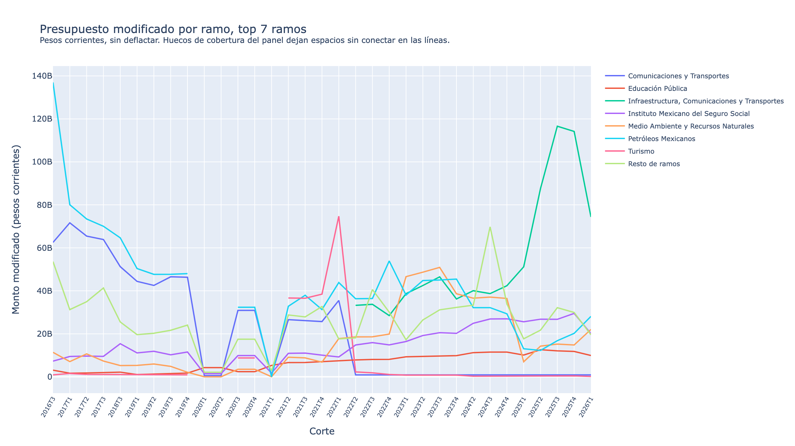
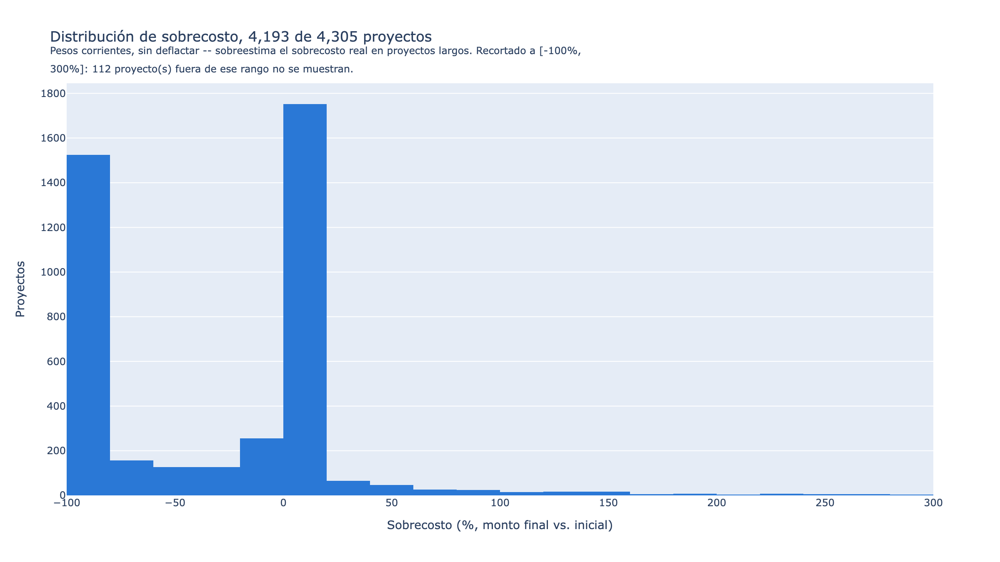

# Galería de figuras

Generadas contra el corte más reciente del panel: **2026T1**. Regenerar con `uv run opa figuras`.

Montos en pesos corrientes (sin deflactar) salvo que se indique lo contrario. Los PNG de Kaleido no son byte-idénticos entre versiones de Chrome -- solo re-commitear cuando cambian los datos o el diseño, no en cada corrida.

## Cobertura del panel por corte trimestral

Cada celda es un trimestre desde el primer corte trimestral disponible hasta el más reciente. Azul son cortes con datos reales del servidor vivo (verde sería Wayback Machine, sin casos hoy -- ver NOTA-TECNICA.md); un asterisco marca cobertura parcial (no es el universo Consolidado completo); rojo son cortes que la fuente declara pero que llegan corruptos; gris son huecos reales, sin ninguna fuente conocida; celdas en blanco son trimestres aún no publicados.

**Nota metodológica:** Esta figura es la credencial metodológica del proyecto: muestra exactamente qué tan completo es el panel, sin suavizar los huecos.

## Universo de PPI por corte

Conteo de proyectos únicos observados en cada corte trimestral. La caída recurrente cada enero-marzo es el patrón estacional Q4→Q1 (re-registro presupuestal de proyectos plurianuales), no un error de carga -- ver dbt/tests/assert_conteo_ppi_por_ramo_estable.sql para la investigación completa.

**Nota metodológica:** Los huecos se muestran como franjas y como líneas cortadas, nunca interpolados.

## Presupuesto modificado por ramo en el tiempo

Serie de presupuesto modificado (pesos corrientes) para los ramos con mayor inversión acumulada, con el resto de ramos agregado en una sola serie.

**Nota metodológica:** Pesos corrientes -- la deflactación a precios constantes está pendiente (ver README).

## Distribución geográfica de los proyectos

Última ubicación conocida de cada proyecto con coordenadas válidas. El tamaño del punto es proporcional (raíz cúbica, para que los megaproyectos no dominen visualmente) al monto total de inversión.

**Nota metodológica:** Solo una fracción del universo trae coordenadas -- el porcentaje real aparece en el título de la figura, calculado contra el total, no estimado.

## Estatus terminal inferido de los proyectos

Clasificación de cada proyecto según su última observación: terminado probable (avance >= 95%), vigente en el último corte disponible, o salida no explicada.

**Nota metodológica:** 'salida_no_explicada' es una inferencia, no un dato oficial de la fuente: puede ser una cancelación real o un proyecto que cayó en un trimestre-hueco del panel.

## Distribución de sobrecosto por proyecto

Histograma de (monto final - monto inicial) / monto inicial, sobre los proyectos con monto inicial positivo.

**Nota metodológica:** Pesos corrientes, sin deflactar -- parte del 'sobrecosto' en proyectos largos es inflación acumulada, no sobrecosto real. El rango mostrado se recorta y se declara cuántos proyectos quedan fuera.
